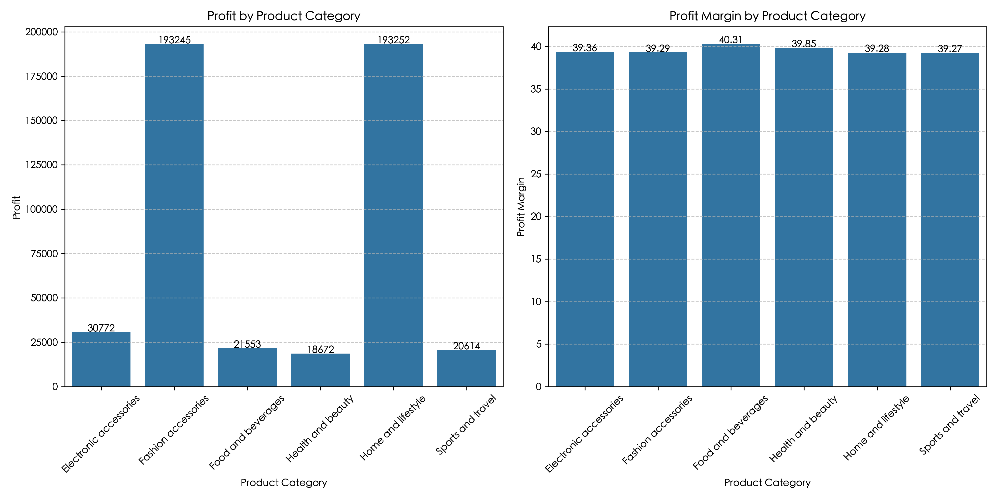
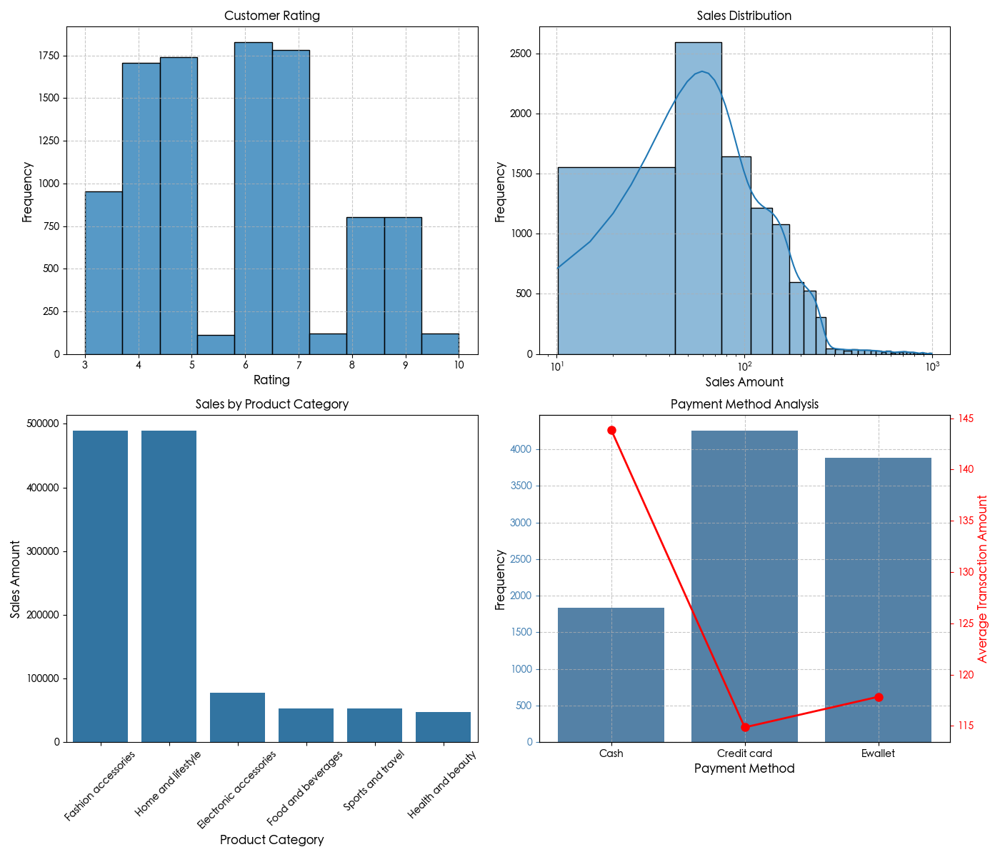
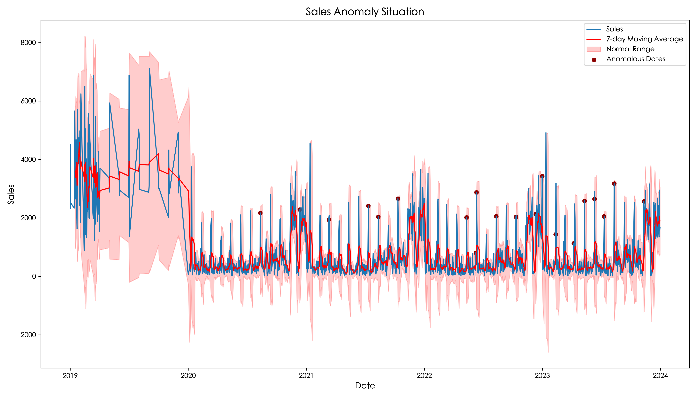
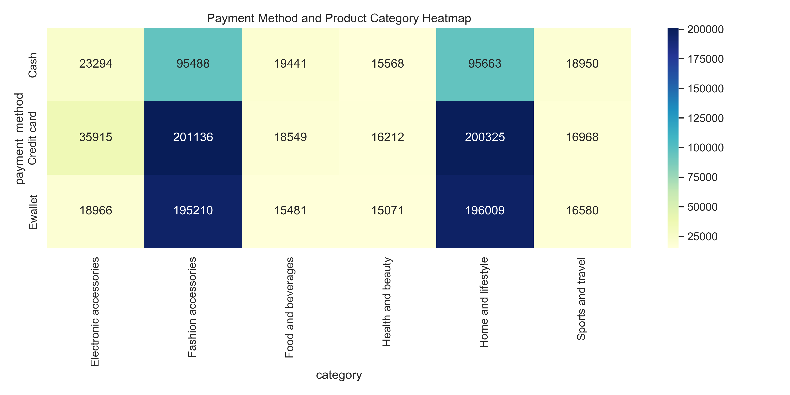

# Walmart Retail Data Analysis and Optimization Strategy

## Project Overview
This project analyzes Walmart sales data through exploratory analysis, time series decomposition, product profitability assessment, and statistical validation to develop four data-driven optimization strategies aimed at mitigating revenue concentration risk, boosting off-season sales, enhancing customer value, and improving payment conversion rates.

---
## Analysis Design Logic

To effectively address retail scenario requirements, the analysis process follows this logic:

- **Exploratory Analysis**: Quickly understand customer ratings, payment methods, and consumption distribution patterns.
- **Time Series Analysis**: Identify sales fluctuation cycles and anomaly peaks to guide promotional activities and staffing arrangements.
- **Category and Profitability Analysis**: Evaluate product profit structure and customer segmentation to discover potential items and pricing strategies.
- **Statistical Validation and Insight Integration**: Use ANOVA/OLS to verify trend differences and ensure data-supported strategies.

## Key Insights

### 1. Overly Concentrated Sales
Only two categories, Fashion and Home, account for over 75% of sales, presenting a revenue concentration risk.

### 2. Multi-peaked Customer Ratings
Ratings primarily cluster at 4, 5, 7, and 9 points, indicating significant gaps between customer experience and expectations.

### 3. Mid-Month Sales Peaks
Year-end is the peak sales season, and the 11th of each month frequently shows abnormally high sales points. The table below shows the statistics of the top 20 anomalies occurring on the 11th.
***We can observe that in 2022 and 2023, the number of anomalies increased and the anomaly multiplier also increased (seven-day average)***

| Year | Occurrences | Total Anomaly Sales | Average Anomaly Multiple |
|------|-------------|---------------------|--------------------------|
| 2020 |     2       |        4453         |          2.19           |
| 2021 |     3       |        8991         |          2.19           |
| 2022 |     6       |       14446         |          2.21           |
| 2023 |     6       |       14435         |          2.22           |

### 4. Payment Methods Significantly Correlated with Consumption
Statistical tests (ANOVA + OLS) show that different payment methods have a significant impact on spending amounts.
- Cash users are high-value customers with significantly higher per-transaction spending
- E-wallet users prefer quick checkout, with lower overall spending but more frequent purchases

---

## Business Recommendations and Strategic Directions

### 1. Product Strategy
- Develop Food/Health potential items to reduce dependence on Fashion/Home
- Use Food as traffic-driving products and Health to enhance brand image and gross margin structure

### 2. Time Strategy
- Establish an "11th Promotion Day" as a fixed activity to stabilize mid-month sales
- Implement reinforcement activities during off-season (April-July) to improve year-round performance

### 3. Customer Strategy
- Establish a tiered membership system with targeted rewards for high-value customers
- Optimize service processes for low-rating customer groups to improve satisfaction

### 4. Payment Strategy
- E-wallet users prefer quick single-item checkout; design real-time single-item promotions
- Introduce loyalty reward systems for high-value cash customers to increase CLV (Customer Lifetime Value)
- Develop point-based benefits for primary credit card users

---

## Analysis Methods and Technical Tools

| Method Type | Tools and Techniques |
|-------------|----------------------|
| Data Processing | Python, Pandas, NumPy |
| Visualization | Matplotlib, Seaborn |
| Statistical Analysis | ANOVA, OLS (Statsmodels, SciPy) |
| Business Analysis | BCG Matrix, Customer Tier Analysis, Time Trend Decomposition |
| Models and Testing | Trend Decomposition, Anomaly Detection, Cross-analysis Heatmaps |

---

## Project Structure

| Notebook | Analysis Content | Description |
|----------|------------------|-------------|
| `01_data_exploration.ipynb` | Exploratory Analysis | Customer ratings, payment methods, product category sales observations |
| `02_time_pattern_analysis.ipynb` | Sales Time Trend Analysis | Trends, seasonality, 11th-day anomaly patterns and promotion potential |
| `03_product_profit_analysis.ipynb` | Product and Consumption Tier Analysis | BCG matrix, potential product analysis, customer tier behavior |
| `04_business_recommendations.ipynb` | Comprehensive Strategy Recommendations and Benefit Analysis | Statistical testing, strategy design, expected outcomes and limitations |

---

## Expected Benefits and Analysis Limitations

### Benefit Estimates
- If the 11th promotion day is successfully implemented, off-season sales are expected to increase by 10-15%
- If Food/Health market share increases by 5%, risk dependence on main categories will be reduced
- Precise payment strategies can improve young user conversion and repurchase rates

### Analysis Limitations
- Analysis data covers 2019-2024, but is not completely continuous
- Data lacks complete membership tagging and historical marketing records
- Predicted effectiveness depends on future A/B testing and actual marketing implementation

---

> This project is a data analysis portfolio piece, fully demonstrating data processing, insight generation, and strategy design processes, suitable for product analysis and marketing analysis position applications and demonstrations.